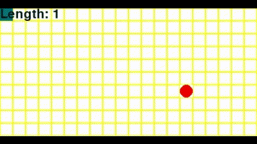

# Gymnasium Snake

贪吃蛇游戏环境 - Gymnasium 兼容版本     

提供具有mask动作的基准离散环境。  

贪吃蛇的核心规则之一是​​蛇不能立即反向移动​​（例如当前向右移动时，下一帧不能直接向左）。这种动作限制需要通过掩码机制实现，否则智能体可能因随机探索或策略误差选择无效动作，导致游戏提前结束。

在标准实现中，蛇的合法动作空间会随当前方向动态变化。例如，若当前方向为右（Right），则左（Left）动作应被屏蔽

环境示例：  
    
## 环境信息

- 环境名称：`Snake-v0`
- 动作维度：`4`（上、下、左、右）
- 观察维度：`6`（蛇头与食物的相对位置、4个方向是否合法）

```python
## basic message
import gymnasium as gym
import gymnasium_snake
env = gym.make('Snake-v0')

ACTION_SPACE = env.action_space.n
OBSERVATION_SPACE = env.observation_space.shape[0]
print(f'Action space: {ACTION_SPACE}, Observation space: {OBSERVATION_SPACE}')
```
## 测试
```python
import gymnasium as gym
import gymnasium_snake
import time
import random

def main():
    env = gym.make('Snake-v0')
    
    obs, info = env.reset()
    total_reward = 0
    step_count = 0
    terminated = False
    truncated = False
    
    while not (terminated or truncated):
        action = env.action_space.sample()
        # 确保选择有效动作
        action_mask = info.get("action_mask", [True] * 4)
        valid_actions = [i for i, valid in enumerate(action_mask) if valid]
        if valid_actions:
            action = random.choice(valid_actions)
        
        obs, reward, terminated, truncated, info = env.step(action)
        time.sleep(0.1)
        
        total_reward += reward
        step_count += 1
        print(f'Step {step_count}, reward = {reward}, terminated = {terminated}, truncated = {truncated}')
    
    print(f'Total reward: {total_reward}')
    env.close()

if __name__ == "__main__":
    main()
```
详细见/tests文件夹。

## 安装

```bash
cd path/to/gymnasium_snake
pip install -e .
```
或者直接从 GitHub 安装：  

```bash
pip install git+https://github.com/wild-firefox/gymnasium_snake.git
```

## 致谢
[https://github.com/sunwuzhou03/reinforcement-learning-lab/blob/main/ppo/custom_env/snake_env.py](https://github.com/sunwuzhou03/reinforcement-learning-lab/blob/main/ppo/custom_env/snake_env.py)